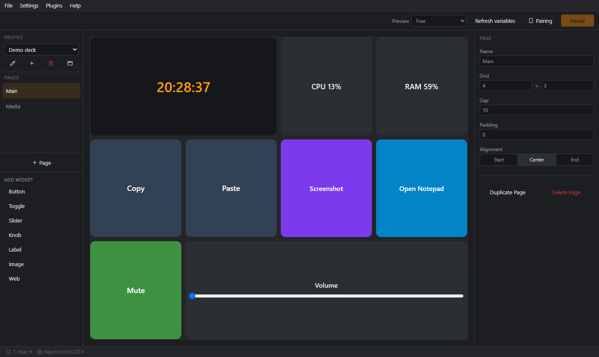
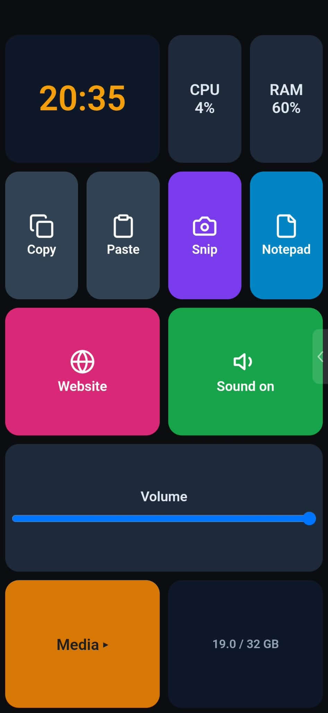

# Macro Grid

[](LICENSE)
[](docs/roadmap.md)
[](https://github.com/Deccoyi/macro-grid/actions/workflows/ci.yml)
[](#requirements)

Turn a phone or tablet on your local network into a customizable macro deck for your Windows PC, like a hardware macro keypad you design yourself.
You lay out buttons, toggles, sliders and knobs on a grid in the editor; the deck shows live values from the PC (CPU, RAM, the time, OBS stream
duration, ...) and presses keys, types text, opens programs, changes the volume and controls other software through plugins.

> **Alpha.** Macro Grid is early software: features and file formats can still change between versions.
>
> ## AI-generated software: you use it entirely at your own risk
>
> All code, design, documentation and artwork of this project were created by artificial intelligence (an AI assistant working at the
> maintainer's direction). Nothing has been reviewed line by line by a human, security-audited or certified for any purpose.
>
> **No warranty, no liability.** The software is provided "as is", without warranty of any kind, express or implied. To the fullest
> extent permitted by law, the authors and contributors accept no responsibility or liability of any kind for it, including for damage,
> data loss, misuse, security problems or any other consequence of installing or using it. All risk is yours: which software you
> install, which devices you pair, which plugins you run and which buttons you press. The installer and the app ask you to accept the
> [user agreement](installer/license-agreement.txt). See also [LICENSE](LICENSE) (MIT).

**Website and user guide: <https://deccoyi.github.io/macro-grid/>** (getting started, tutorials, reference). **[Download](https://deccoyi.github.io/macro-grid/download)** · **[Phone app](https://deccoyi.github.io/macro-grid-client/)** · **[Plugin store](https://deccoyi.github.io/macro-grid-plugin/store/)**

This repository is the **server and editor**. The three parts are versioned independently:

| Repository | What it is |
|---|---|
| [Deccoyi/macro-grid](https://github.com/Deccoyi/macro-grid) (this one) | Windows server, editor, browser deck, plugin SDK |
| [Deccoyi/macro-grid-client](https://github.com/Deccoyi/macro-grid-client) ([site](https://deccoyi.github.io/macro-grid-client/)) | Android phone and tablet app |
| [Deccoyi/macro-grid-plugin](https://github.com/Deccoyi/macro-grid-plugin) ([store](https://deccoyi.github.io/macro-grid-plugin/store/)) | Plugins (OBS, PLC icons, ...) and the plugin authoring docs |

## Screenshots





## What it does

- **The server** runs on Windows as a tray application. It stores profiles, talks to the deck over a WebSocket (port 9820) and runs the actions on the PC:
  key combinations, typing text, opening programs and URLs, switching pages and profiles, delays, volume and mute, and whatever plugins add. Several actions
  bound to one event run in order, which makes a macro.
- **The editor** opens in the server's own window. You design pages on a grid by dragging widgets, style them (colors, icons, animation, custom CSS),
  assign actions to press, long press and double tap, and preview the result live.
- **Live values.** Widgets show text such as `CPU {system.cpu|0}%`, and a widget's color, animation, icon or text can change with a value through simple rules:
  "if CPU is above 80 blink red".
- **Sliders and knobs** are two-way: they can control the Windows volume and follow it when it changes elsewhere.
- **Several devices and profiles.** Each paired device can show a different profile, and a device can follow the active window on the PC (a media player
  comes to the front, the deck switches to its profile).
- **Plugins.** OBS control, icon packs and your own, in C# or in sandboxed JavaScript; installed and reloaded without a restart.
- **Profile files.** Export a profile as a single `.msprofile` file and import it elsewhere.
- **Browser deck.** Any browser on the network can act as a deck at `http://<PC address>:9820/deck/`.

All communication stays on your local network.

## Requirements

- Windows 10 or 11.
- The [WebView2 Runtime](https://developer.microsoft.com/microsoft-edge/webview2/) (part of current Windows).
- A phone or tablet on the same network with the [Android app](https://github.com/Deccoyi/macro-grid-client), or any browser.

## Install

Get the latest Windows installer (`MacroGrid-Setup-<version>.exe`) from the [download page](https://deccoyi.github.io/macro-grid/download), which also lists the
previous versions, or from the [GitHub Releases](https://github.com/Deccoyi/macro-grid/releases) page, and run it. You can also build from source (below). The installer is not
code-signed yet, so Windows SmartScreen may warn on first run. How releases are made: [docs/guides/release.md](docs/guides/release.md).

## Getting started

1. Install and start the server (see above; or build it from source, below). It appears as a tray icon; the menu opens the editor.
2. Open the editor's **Pairing** window: it shows a six-digit PIN and a QR code, valid for five minutes.
3. On the phone, open the app, then scan the QR code (or enter the PC's address and the PIN). The device is paired and shows the profile.
4. Design your pages in the editor. Saving updates connected devices immediately.

Macro Grid speaks Turkish and English. The editor, the tray menu and the plugins' texts follow your Windows display language (Turkish on a Turkish Windows, English otherwise) until you pick a language in Preferences; the browser deck and the phone app follow the language of the browser or phone.

## Build from source

You need the [.NET 10 SDK](https://dotnet.microsoft.com/download) and [Node.js](https://nodejs.org/) 20 or newer.

```powershell
cd editor;    npm install; npm run build; cd ..
cd webclient; npm install; npm run build; cd ..
Copy-Item editor\dist\*    src\MacroGrid.Host\wwwroot\editor -Recurse -Force
New-Item -ItemType Directory -Force src\MacroGrid.Host\wwwroot\deck | Out-Null
Copy-Item webclient\dist\* src\MacroGrid.Host\wwwroot\deck -Recurse -Force
dotnet run --project src/MacroGrid.Host
```

Run the tests with `dotnet test`. More in [docs/guides/development.md](docs/guides/development.md).

## Security

Macro Grid is designed for a home or office network you trust, not for the internet.

- Traffic is not encrypted. The server listens on all network interfaces on port 9820; do not forward the port, and allow it in the firewall only for
  private networks.
- A device must be paired with the PIN, and tokens are stored in plain text in `%AppData%\MacroGrid\devices.json`.
- A paired device can press keys, type text and start programs on your PC. Pair only devices you trust.
- The editor API is reachable only from the server's own computer.
- C# plugins have full trust and can do anything the server can; install only ones you trust. JavaScript plugins are sandboxed.

Details are in [docs/architecture.md](docs/architecture.md#security-model). To report a security problem, see [SECURITY.md](SECURITY.md).

## Documentation

- [Website and user guide](https://deccoyi.github.io/macro-grid/): getting started, tutorials and reference for users (its source is in `website/`)
- [Architecture](docs/architecture.md): how it is put together, the protocol and the security model
- [Development](docs/guides/development.md): building, running, testing and the pitfalls
- [Roadmap](docs/roadmap.md): what is done and what is next
- [Releasing](docs/guides/release.md) and [versioning](docs/guides/versioning.md)
- [Design notes](docs/design/): automatic profile switching, layout patches and cached assets, JavaScript plugins
- [UI guidelines](docs/ui/ui-guidelines.md) and [color system](docs/ui/color-bible.md)
- [Changelog](docs/CHANGELOG.md) (short) and [developer changelog](docs/CHANGELOG-developer.md)
- Writing plugins: `docs/plugin-authoring.md` in the [plugin repository](https://github.com/Deccoyi/macro-grid-plugin)

## Contributing

See [CONTRIBUTING.md](CONTRIBUTING.md).

## License

[MIT](LICENSE).

## Third-party licenses

Macro Grid uses open-source libraries. The full list with versions, licenses and copyright holders is in [THIRD_PARTY_NOTICES.md](THIRD_PARTY_NOTICES.md), and the original license text of every library is in the [licenses/](licenses/) folder. The installer and the release folder include both, plus the [LICENSE](LICENSE) file. The app icons are AI-generated.
